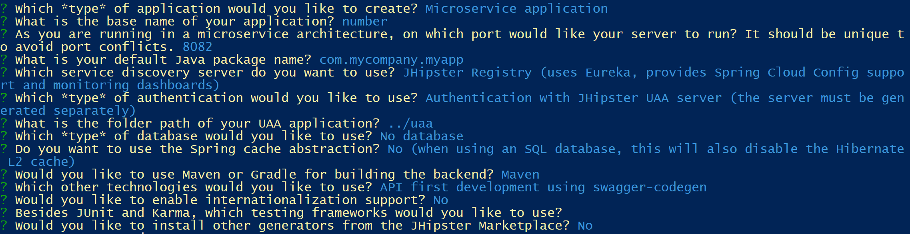

# Jhispter-Kubernetes
Demos Jhispter and Kubernetes and microservices


## 1) Generate all 4 projects

In a new folder, generate the JHipster microservices architecture:

* directory `/uaa`: User Account and Authentication (UAA) Server.
* directory `/catalog`: Microservice catalog.
* directory `/contoso`: Gateway contoso Angular 5.
* directory `/number`: Microservice number.

Calling **yo jhipster** to generate all *Maven* 4 projects

**User Account and Authentication (UAA) Server**:


**Microservice catalog**:


**Gateway contoso**:


**Microservice number**:


## 2) Adding a Product entity

In `/catalog`, generate a **product** entity:

* `yo jhipster:entity product`
* Add field `name` of type *String*, and marked as *Required*.
* Add field `price` of type *Double*, and marked as *Required*.
* Add field `isbn` of type *String*.

## 3) Test the solution

Stop all current instances:
* `docker stop $(docker ps -a -q)`
* `docker rm $(docker ps -a -q)`

Launch docker images:
* `docker-compose -f uaa/src/main/docker/mysql.yml up -d`
* `docker-compose -f catalog/src/main/docker/jhipster-registry.yml up -d`
* `docker-compose -f catalog/src/main/docker/mongodb.yml up -d`

Execute `mvnw` in each folder, in the correct order:
* uaa
* catalog
* contoso


Check those URLS:
* Check if the **JHipster registry** is running: [http://localhost:8761](http://localhost:8761).
* Check if the **/catalog** microservice exposes the product swagger contract: [http://localhost:8081/v2/api-docs](http://localhost:8081/v2/api-docs)
* Check if the **/contoso** gateway is available : [http://localhost:8080](http://localhost:8080)

## 4) Adding IsbnResource in the /number microservice

In `/number/src/main/java/com/mycompany/myapp/web/rest` add the following code in a java class called **IsbnResource.java**:

``` java
package com.mycompany.myapp.web.rest;

import org.springframework.web.bind.annotation.GetMapping;
import org.springframework.web.bind.annotation.RequestMapping;
import org.springframework.web.bind.annotation.RestController;

@RestController
@RequestMapping("/api")
public class IsbnResource {

    @GetMapping("/isbn")
    public String generateIsbnNumber() {
        return "ISBN-" + Math.random();
    }
}

```

Test those two urls to check if *Swagger* is available and the isbn result as well:
* [http://localhost:8082/v2/api-docs](http://localhost:8082/v2/api-docs) 
* [http://localhost:8082/api/isbn](http://localhost:8082/api/isbn) : Should return an *unauthorized* error !

### Disable the authentication for testing purpose

In `/config/MicroserviceSecurityConfiguration.java`, make a small modification :

* Change `.antMatchers("/api/**").authenticated()`
* With   `.antMatchers("/api/**").permitAll()`   
* Then test again [http://localhost:8082/api/isbn](http://localhost:8082/api/isbn): Should return a correct isbn number.

An after revert to `authenticated()`

## 5) Generate the /catalog code with the swagger generator

In `/catalog` directory, generate the server code using the `jhispter-swagger-cli`:

* `yo jhipster-swagger-cli`


In `/client/isbn/api/ApiApiClient.java` replace the code and use the `@AuthorizedFeignClient` annotation code :

``` java
package com.mycompany.myapp.client.isbn.api;

import com.mycompany.myapp.client.AuthorizedFeignClient;

@AuthorizedFeignClient(name="number")
public interface ApiApiClient extends ApiApi {
}

```

In `/web/rest/ProductResource.java`, replace the following code:

``` java
@Autowired
private ApiApiClient isbnClientApi;

@PostMapping("/products")
@Timed
public ResponseEntity<Product> createProduct(@Valid @RequestBody Product product) throws URISyntaxException {
    log.debug("REST request to save Product : {}", product);
    if (product.getId() != null) {
        throw new BadRequestAlertException("A new product cannot already have an ID", ENTITY_NAME, "idexists");
    }

    String isbnNumber = isbnClientApi.generateIsbnNumberUsingGET().getBody();
    product.setIsbn(isbnNumber);

    Product result = productRepository.save(product);
    return ResponseEntity.created(new URI("/api/products/" + result.getId()))
        .headers(HeaderUtil.createEntityCreationAlert(ENTITY_NAME, result.getId().toString()))
        .body(result);
}

```

## 6) Generate the kubernetes config

Create a `/kubernetes` folder

in the `/kubernetes` dir, launch the `yo jhipster:kubernetes` command

## 7) Generate the dockers images

Generate the missing Docker image(s):
``` 
./mvnw verify -Pprod dockerfile:build in \catalog
./mvnw verify -Pprod dockerfile:build in \contoso
./mvnw verify -Pprod dockerfile:build in \number
./mvnw verify -Pprod dockerfile:build in \uaa
```
Push images to a registry: Tag and push the images:

```
docker image tag catalog spertus/catalog
docker push spertus/catalog
docker image tag contoso spertus/contoso
docker push spertus/contoso
docker image tag number spertus/number
docker push spertus/number
docker image tag uaa spertus/uaa
docker push spertus/uaa
```

### 8) Create a kubernetes cluster in AZURE

Login to your **Azure** account and follow the instructions (you will have to copy paste a generated code):
```
az login

-- Check if you have valid subscription:
az account list --output table
```

Create a resource group named `rgkub` on **AZURE** :
```
az group create --name rgkub --location westeurope
```

Now, we are going to use the `aks` command line. See more informations about `aks` here : [https://docs.microsoft.com/en-us/cli/azure/aks?view=azure-cli-latest](https://docs.microsoft.com/en-us/cli/azure/aks?view=azure-cli-latest)

Then use `aks` to create and manage a new kubernetes cluster named `jhkub`:
```
-- Create a cluster named jhkub with 5 nodes and get the ssh keys locally
az aks create --resource-group rgkub --name jhkub --node-count 5 --generate-ssh-keys

-- Open a connection to the kubernetes cluster to be able to use kubectl command line
az aks get-credentials --resource-group rgkub --name jhkub

```

Usefuls command lines:

```
-- OPTIONAL : Set the default resource group (to omit --resource-group in command lines)
az configure --defaults group=rgkub

-- Get managed kubernetes cluster
az aks list --output table

-- Show a managed aks
az aks show --resource-group rgkub --name jhkub

-- Browse (with port forwarding) an aks dashboard
az aks browse --resource-group rgkub --name jhkub

-- Check versions available for my current cluster
az aks get-versions --resource-group rgkub --name jhkub --output table

-- Upgrade your cluster
az aks upgrade --resource-group rgkub --name jhkub --kubernetes-version 1.8.2

-- Scale node count
az aks scale --resource-group rgkub --name jhkub --node-count 10 
```

### 9) Apply kubernetes config on AZURE kubernetes cluster:

You can deploy all your apps by running:

```
kubectl apply -f registry
kubectl apply -f catalog
kubectl apply -f contoso
kubectl apply -f number
kubectl apply -f uaa
```

Use these commands to find your application's IP addresses:
```  
kubectl get svc contoso
```

Useful commands to monitor your kubernetes cluster:
```
-- watcher on pods / svc status
kubectl get pods --watch
kubectl get svc --watch

-- Get deployment
kubectl get deployment

-- OPTIONAL : Scale on 3 replicats
kubectl scale deployment catalog --replicas 3

-- OPTIONAL : Port forwarding to see jhipster registry 
kubectl port-forward [podname] 8761:8761
```

### 10) Adding a DNS to the public ip address

If you try the application with the direct IP (something like [http://52.174.25.153:8080](http://52.174.25.153:8080), you will have an error during the authentication step. 

If you get the logs from the `Contoso` pod using the command `kubectl logs [podname]` you will see something like:

```
java.lang.IllegalArgumentException: Not a valid domain name: '52.174.25.153'
        at com.google.common.base.Preconditions.checkArgument(Preconditions.java:210)
        at com.google.common.net.InternetDomainName.<init>(InternetDomainName.java:155)
        at com.google.common.net.InternetDomainName.from(InternetDomainName.java:216)
        at com.mycompany.myapp.security.oauth2.OAuth2CookieHelper.getCookieDomain(OAuth2CookieHelper.java:296)
        at com.mycompany.myapp.security.oauth2.OAuth2CookieHelper.createCookies(OAuth2CookieHelper.java:109)
        at com.mycompany.myapp.security.oauth2.OAuth2AuthenticationService.authenticate(OAuth2AuthenticationService.java:70)
        at com.mycompany.myapp.web.rest.AuthResource.authenticate(AuthResource.java:51)
```

To be able to resolve this issue, open the resource group **generated** by Azure (not **rgkub** for instance), and open the **Public IP Address** resource:


Then on the **configuraition** tab, add a sub domain (`snowkub` in my example):


Now use the fully complete address to reach your **Contoso** front web application:

[http://snowkub.westeurope.cloudapp.azure.com:8080](http://snowkub.westeurope.cloudapp.azure.com:8080)


